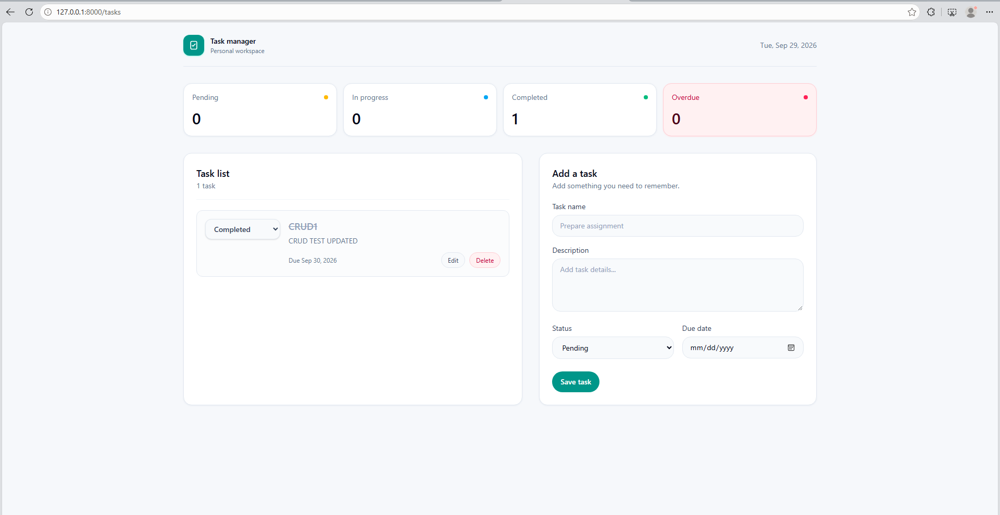

README.
# Personal Task Manager

## Project Code

WST21-PM-2026-SF

## Student Name

[Mark Anthony B. Sanchez]

## Course & Year

BSIT 2nd Year

## Database Used

MySQL

## Features

- Add Task
- View Tasks
- Edit Task
- Delete Task
- Update Status

## How It Works

### 1. View Tasks

Users can view all saved tasks and see their status, description, and due date.

1. View Tasks

Users can view all saved tasks and see their status, description, and due date.

2. Add a Task

Users enter the task name, description, status, and due date, then click Save Task.

3. Edit a Task

Users can click Edit to update the task details.

4. Manage Status

Tasks can be marked as Pending, In Progress, or Completed. The dashboard updates the task counts automatically.

5. Delete a Task

Users can click Delete to remove a task from the list.

6. Dashboard

The dashboard shows the number of Pending, In Progress, Completed, and Overdue tasks.